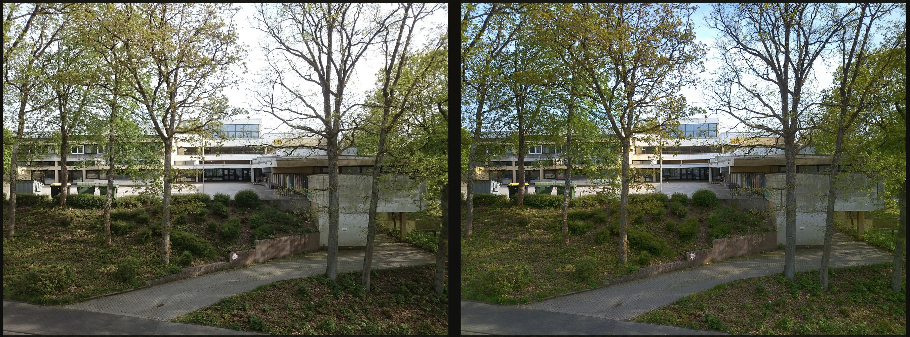
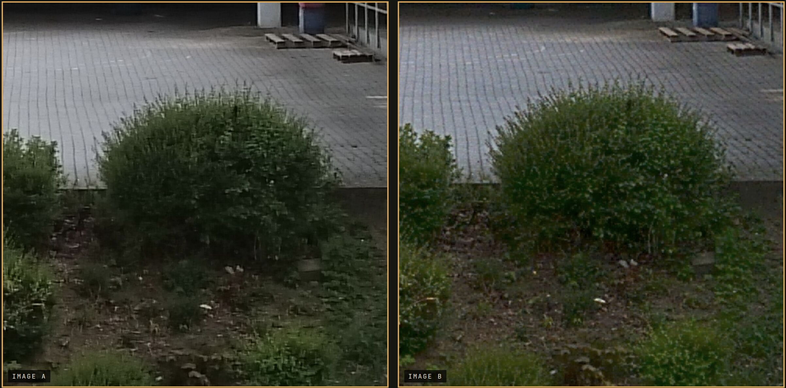
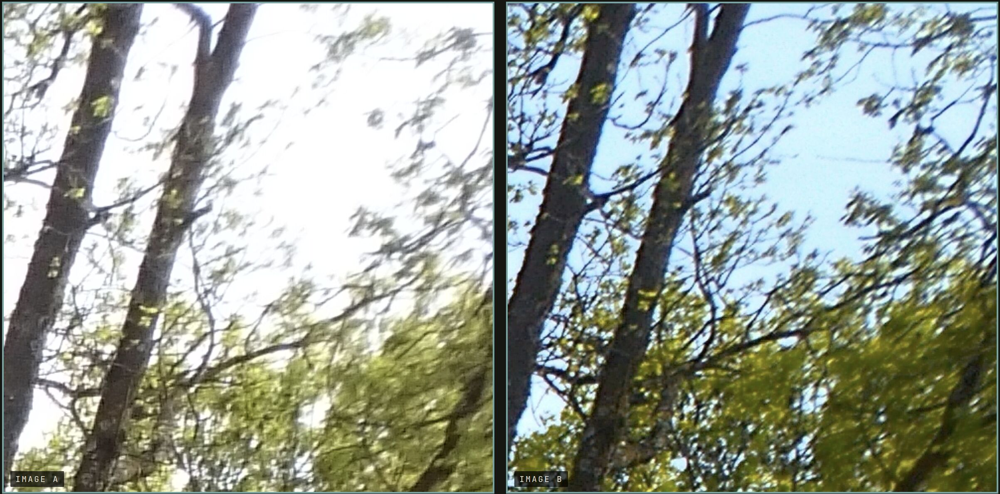
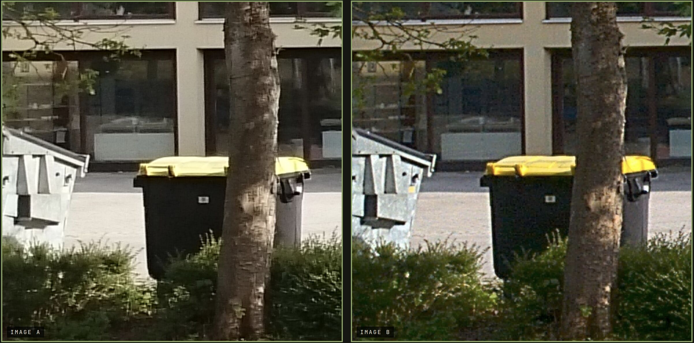

# CalibSense

A self-contained image-processing pipeline for Sony IMX220-series sensors
(Xperia Z1/Z2/Z3, 20.7 MP). CalibSense bypasses the hardware ISP and
processes packed 10-bit RGGB Bayer frames directly on the CPU,
producing a DNG and (optionally) a JPEG.

The library is written in portable C++14 with no dependencies beyond
libc, libstdc++, and pthreads. The hot inner loops have ARM NEON paths;
everything else falls back to scalar and the build still works on any
target architecture.

## Comparisons

Each image below shows the stock D5503 camera output on the left and
CalibSense on the right.









## Build

CalibSense uses CMake. The intended target is 32-bit Android (the
D5503's native ABI), but it also builds and runs on a desktop host for
offline testing.

```sh
cmake -B build \
      -DCMAKE_TOOLCHAIN_FILE=$ANDROID_NDK/build/cmake/android.toolchain.cmake \
      -DANDROID_ABI=armeabi-v7a \
      -DANDROID_PLATFORM=android-21 \
      -DCMAKE_BUILD_TYPE=Release
cmake --build build
```

The output is `build/libcalibsense.so`. For a host build (used for
offline testing), drop the toolchain and Android-specific flags and
invoke `cmake -B build -DCMAKE_BUILD_TYPE=Release` directly.

## Usage

The public API lives in `include/calibsense/calibsense.h` and consists
of two C entry points.

The simple path — read a RAW file from disk, write a DNG (and a sibling
`.jpg`) next to it:

```c
#include "calibsense/calibsense.h"

int rc = calibsense_process_file("/sdcard/DCIM/IMG_0001.raw",
                                 /*wb_path=*/ NULL,
                                 "/sdcard/DCIM/IMG_0001.dng");
```

The in-memory path — used on-device, where the RAW comes straight from
the camera HAL:

```c
int rc = calibsense_process_frame(
    raw_header, header_size,    // 3272-byte Sony header
    raw_packed, raw_size,       // packed 10-bit Bayer, 7000 bytes/row
    width, height,              // 5248 × 3936 at full resolution
    "/path/to/output.dng",
    /*wb_data=*/ wb_sidecar);   // optional Q16.16 R/G/B AWB gains
```

Both functions return `0` on success.

## Streaming output (optional)

Instead of writing files, CalibSense can stream DNG and JPEG bytes
over an abstract Unix-domain socket. This is the path used on-device:
the library runs inside the camera HAL process and the app's UI
process connects in to receive frames as they're produced.

Enable the listener once at startup:

```c
#include "delivery.h"   // src/core/delivery.h

calibsense_delivery_start();   // idempotent; returns 0 on success
```

After that, any `calibsense_process_frame()` call streams its DNG
(and optional JPEG) to whichever peer is currently connected. If no
peer is attached, the call falls back to the file path — or no-ops
if there's no file path either.

### Wire format

The socket is an abstract-namespace `AF_UNIX` `SOCK_STREAM` at name
`calibsense_socket` (with the standard leading NUL byte that puts the
address into the abstract namespace). Each frame on the wire is:

```
  4 bytes   magic         little-endian uint32
  4 bytes   body length   little-endian uint32
  N bytes   body          a complete DNG or JPEG file
```

Two magics are defined in `delivery.h`:

| Magic (LE u32) | ASCII | Payload                              |
|----------------|-------|--------------------------------------|
| `0x31474E44`   | DNG1  | uncompressed DNG (~41 MB at 20 MP)   |
| `0x3147504A`   | JPG1  | baseline JPEG (~3-6 MB typical)      |

A receiver `connect()`s to the socket and loops: read 8 bytes of
header, parse `body_len`, read that many more bytes, dispatch on
`magic`.

### Things to know about the channel

- **Single peer.** Only one connection is kept alive at a time; a new
  connect evicts the old one.
- **Non-blocking, drop-on-slow-reader.** The server tears down the
  connection rather than blocking the camera pipeline if the peer
  falls behind (the timeout is ~1 s per 64 KB chunk). Consumers should
  drain promptly.
- **Peer-uid gated.** The listener checks the connecting peer's uid
  via `SO_PEERCRED` and only accepts uids in the Android app range
  (10000-19999). Connections from outside that range — including
  desktop user uids during host-side testing — are silently dropped.
  Adjust `PEER_UID_MIN` / `PEER_UID_MAX` in `src/core/delivery.cpp` if
  you need different gating.

## Requirements

- C++14 toolchain (GCC or Clang)
- pthreads
- libm
- For the SIMD fast path: ARM with NEON (ARMv7 built with `-mfpu=neon`,
  or any AArch64). On other architectures the NEON paths compile out
  and scalar fallbacks run.

## Architecture

The Bayer-domain stages run in a fixed order chosen to keep noise
contained and prevent demosaic-stage color fringing:

**1. Lens shading correction.** Factory-calibrated 7×9 LSC tables for
daylight (D65) and tungsten (Standard A) illuminants are parsed from
the RAW header and blended by a "warmth" heuristic computed from the
WB gains. The strength is reduced per grid cell wherever full
correction would push pixels into saturation — the safe LSC fraction
is solved exactly from the cell's brightest input, smoothed across the
grid, and bilinearly sampled in the inner loop. A per-channel
rebalancing step then removes the global magenta cast that the raw
factory tables would otherwise introduce.

**2. Bayer-domain noise reduction.** Black-level subtract and white
balance run first; then each 2×2 RGGB block is transformed into four
orthonormal Hadamard channels: Y (pseudo-luma), CH/CV (horizontal /
vertical contrast), and CD (diagonal). A 3-level 2D Haar wavelet
decomposition is applied per channel, with BayesShrink soft
thresholding driven by σ estimated via MAD on the finest-scale HH
band. Real signal concentrates in Y, so Y is filtered lightly while
CH/CV/CD are thresholded aggressively — preserving low-amplitude
texture that a bilateral filter would smear out.

**3. Directional demosaicing.** A 5×5 Malvar-He-Cutler kernel is the
baseline. At each pixel the algorithm computes Hamilton-Adams
horizontal and vertical gradients; when one direction is clearly
dominant it switches to a horizontal-only or vertical-only kernel,
preventing the demosaicer from averaging across an edge. In flat or
textured regions where the gradient difference is below threshold,
the symmetric MHC is used as a safe fallback.

After demosaic, the RGB stages run sRGB color conversion, exposure
adjustment (a luma-driven Reinhard-style filmic curve), saturation,
gamma, unsharp-mask sharpening, and JPEG encoding.

## Performance

The pipeline targets the original quad-core Snapdragon 800 and runs
alongside the host's existing capture flow. Two optimizations together
account for a large per-frame speedup compared to an unoptimized
scalar, single-threaded baseline:

**Multi-threading.** A small pthread-based row-band dispatcher
(`src/util/threading.{h,cpp}`) splits per-row work across cores. The
dispatcher uses no locks during work — bands are independent, and the
caller's thread runs the last band concurrently with the spawned
workers, giving N-way parallelism with N−1 spawns. Demosaic,
sharpening, color conversion, the BL+WB+LSC pass, and the four
Hadamard channels in NR all use this.

**ARM NEON SIMD.** Three hot paths have NEON inner loops:

- **Exposure curve.** The Reinhard-style ratio
  `exposure / (1 + (e−1)·Y)` is evaluated per pixel via `vrecpeq_f32`
  plus a single Newton refinement step (`vrecpsq_f32`), avoiding
  scalar division.
- **Sharpening.** The separable 17-tap Gaussian blur processes 4
  output pixels per iteration with widening loads and `vmlaq_n_f32`
  multiply-accumulates.
- **JPEG RGB → YCbCr conversion.** `vld3q_u8` deinterleaves 16 pixels
  per load; multiply-accumulates produce 8 Y / Cb / Cr lanes at a
  time. The forward DCT itself is the scalar integer `jfdctint`
  algorithm — only the color-conversion stage of the JPEG encoder is
  vectorized.

Other stages (Haar wavelet transforms, directional MHC, gamma LUT
lookup, DCT, Huffman coding) are scalar.

## Source layout

```
include/calibsense/calibsense.h    Public C API
src/core/                          Pipeline orchestration, DNG/TIFF writer, delivery socket
src/imaging/                       LSC, Bayer NR, demosaic, sharpening
src/jpeg/                          Baseline JPEG encoder + EXIF
src/util/                          pthread row-band dispatcher
CMakeLists.txt                     Build script
```

## License

Licensed under the Apache License, Version 2.0. See [LICENSE](LICENSE)
for the full text.
